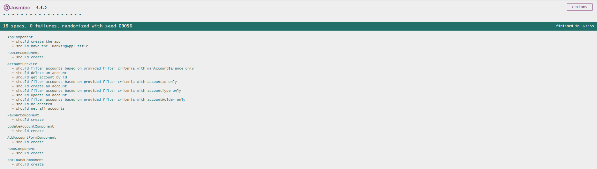

# Bank App - Front End (Angular)

This is the frontend for an Bank Application. It provides a user interface for interacting with the Account API, to manage user's bank accounts.

## Installation

1. Clone this repository.
2. Navigate to the project directory.
3. Run `npm install` to install dependencies.
4. Run `ng serve` to start the development server.
5. Navigate to `http://localhost:4200/` in your browser.

## Usage

Replace `localhost:8080` with the base URL of your API in the frontend Angular application to make requests to the REST API.

## Banking App - REST API

#### `GET /api/v1/account`

- **Description:** Retrieves all stored accounts.
- **Response:**
  - Status Code: 200
  - Content Type: application/json
  - Body: List of account objects

#### `GET /api/v1/account/{accountId}`

- **Description:** Retrieves an account by its ID.
- **Parameters:**
  - `accountId` (path): The ID of the account to retrieve.
- **Response:**
  - Status Code: 200 if successful, 404 if account not found
  - Content Type: application/json
  - Body: Account object

#### `POST /api/v1/account`

- **Description:** Creates a new account.
- **Request Body:** Account object
- **Response:**
  - Status Code: 200 if successful, 400 if request is invalid
  - Content Type: application/json
  - Body: Created account object

#### `PUT /api/v1/account/{accountId}`

- **Description:** Updates an existing account.
- **Parameters:**
  - `accountId` (path): The ID of the account to update.
- **Request Body:** Updated account object
- **Response:**
  - Status Code: 200 if successful, 400 if request is invalid, 404 if account not found
  - Content Type: application/json
  - Body: Updated account object

#### `DELETE /api/v1/account/{accountId}`

- **Description:** Deletes an account by its ID.
- **Parameters:**
  - `accountId` (path): The ID of the account to delete.
- **Response:**
  - Status Code: 200 if successful

#### `GET /api/v1/account/accountType/{accountType}`

- **Description:** Finds accounts by account type.
- **Parameters:**
  - `accountType` (path): The type of account to search for.
- **Response:**
  - Status Code: 200
  - Content Type: application/json
  - Body: List of account objects

#### `GET /api/v1/account/accountHolder/{accountHolder}`

- **Description:** Finds accounts by account holder.
- **Parameters:**
  - `accountHolder` (path): The name of the account holder to search for.
- **Response:**
  - Status Code: 200
  - Content Type: application/json
  - Body: List of account objects

#### `GET /api/v1/account/filterAccounts`

- **Description:** Filters accounts by ID, type, holder, and minimum balance.
- **Parameters:**
  - `accountId` (query, optional): Filter by account ID.
  - `accountHolder` (query, optional): Filter by account holder.
  - `accountType` (query, optional): Filter by account type.
  - `minAccountBalance` (query, optional): Filter by minimum account balance.
- **Response:**
  - Status Code: 200
  - Content Type: application/json
  - Body: List of account objects

## Unit Test Results

